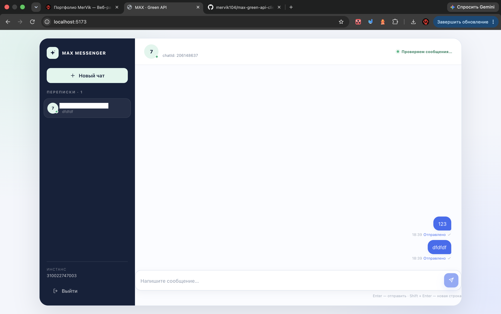

# MAX × Green API

Небольшой веб-клиент для отправки и получения текстовых сообщений в мессенджере MAX через Green API. Приложение работает без собственного бэкенда: браузер напрямую обращается к API выбранного инстанса.

## Возможности

- авторизация по `idInstance`, `apiTokenInstance` и `apiUrl`;
- проверка номера через `checkAccount` и получение настоящего `chatId` MAX;
- отправка текстовых сообщений через `sendMessage`;
- получение входящих и исходящих уведомлений через HTTP API polling;
- удаление каждого уведомления через `deleteNotification`;
- фильтрация статусов, медиа и уведомлений других чатов;
- защита от дублей по `idMessage`;
- статусы «Отправляется…», «Отправлено», «Доставлено» и «Ошибка» с повторной отправкой;
- обработка `noAccount`: приложение повторно вызывает `checkAccount`, обновляет `chatId` и предлагает повторить сообщение;
- автоскролл, пустое состояние, адаптивная компоновка и выход из аккаунта.

Поддерживаются только текстовые сообщения. Медиа, файлы, группы и загрузка истории не реализованы.

## Стек

- React 19;
- TypeScript в строгом режиме;
- Vite;
- Zustand: независимые сторы `session` и `chat`;
- CSS Modules;
- ESLint и Prettier.

## Скриншот



## Запуск

Требуется Node.js версии, поддерживаемой Vite 8 (рекомендуется Node.js 20.19+ или 22.12+).

```bash
npm install
npm run dev
```

Откройте адрес, который покажет Vite, обычно `http://localhost:5173`.

Другие команды:

```bash
npm run build
npm run preview
npm run lint
npm run format
npm run format:check
```

## Деплой на GitHub Pages

В проекте уже настроен workflow `.github/workflows/deploy.yml`: после пуша в ветку `main` он собирает приложение и публикует содержимое `dist` через GitHub Pages.

1. Создай репозиторий на GitHub и добавь его как `origin`.
2. Выполни `git push -u origin main`.
3. В `Settings → Pages` выбери `Source: GitHub Actions`.
4. Открой адрес, который покажет вкладка `Actions` после успешного деплоя.

Для публикации на `https://<user>.github.io/<repo>/` в `vite.config.ts` уже установлен относительный `base`, поэтому отдельная настройка пути не требуется.

## Как получить параметры Green API

1. Откройте [личный кабинет Green API для MAX](https://green-api.com/max).
2. Создайте или выберите инстанс MAX.
3. Авторизуйте в нём аккаунт MAX и дождитесь состояния `authorized`.
4. В настройках инстанса скопируйте:
   - `idInstance` — идентификатор инстанса;
   - `apiTokenInstance` — токен доступа к API;
   - `apiUrl` — адрес API, который показывает кабинет или ответ `getSettings` конкретного окружения.
5. В приложении введите эти три значения на экране авторизации.

`apiUrl` не зашит в исходный код. Если автоматическое определение адреса в окружении невозможно, его нужно скопировать из кабинета вручную. Обычно адрес имеет вид `https://api.green-api.com`, но всегда используйте значение, указанное для вашего инстанса.

## Настройки инстанса

- Аккаунт MAX должен быть авторизован и подключён к инстансу Green API.
- Для этого клиента используется polling через `receiveNotification`; публичный webhook URL не нужен.
- Если в кабинете есть отдельная настройка webhook, для этого варианта её можно отключить или оставить пустым, чтобы уведомления обрабатывались только polling-запросом.
- Убедитесь, что тариф и лимиты инстанса разрешают нужное количество запросов. Для тестового сценария обычно подходит Developer-тариф, но его ограничения зависят от текущего плана Green API.

## Как работает обмен сообщениями

1. `getStateInstance` проверяет доступ к инстансу на экране авторизации.
2. После ввода номера отправляется `checkAccount` с телом `{ "phoneNumber": "<номер>" }`.
3. Если `exist: false`, чат не создаётся и показывается сообщение: «В MAX нет аккаунта с этим номером».
4. Если `exist: true`, приложение сохраняет полученный `chatId`. Номер телефона используется только как подпись контакта.
5. `sendMessage` отправляет `{ "chatId": "<chatId>", "message": "<текст>" }`.
6. Polling запрашивает `receiveNotification`, обрабатывает только `incomingMessageReceived` и `outgoingMessageReceived` с `typeMessage` `textMessage` или `extendedTextMessage`, затем обязательно вызывает `deleteNotification` для `receiptId`.
7. Уведомления для другого `chatId`, статусы доставки и прочие типы удаляются, но не добавляются в UI.
8. При ошибке `noAccount` отправка не считается успешной: приложение повторяет `checkAccount`, обновляет `chatId` и оставляет сообщение в состоянии ошибки с кнопкой «Повторить».

## Хранение данных и безопасность

Сессия и активный чат сохраняются в `localStorage` браузера:

- `max-green-api-session` — `idInstance`, `apiTokenInstance`, `apiUrl` и признак авторизации;
- `max-green-api-chat` — `chatId`, номер телефона и локальные сообщения.

`apiTokenInstance` — секретный токен. Не открывайте приложение на общем компьютере и не публикуйте токен в исходном коде или `.env`-файлах. При выходе из аккаунта значения сессии и чата сбрасываются.

## CORS и ограничения браузера

Green API должен разрешать запросы с origin, на котором запущено приложение. Если в консоли браузера появляется CORS-ошибка, приложение покажет отдельное понятное сообщение, но исправить серверную политику Green API из браузера невозможно. Для локальной разработки обычно используйте разрешённый origin Green API или среду, настроенную для CORS.

Возможные ограничения:

- Developer-тариф и лимиты запросов Green API;
- задержки и таймауты long polling;
- необходимость заново авторизовать аккаунт MAX после его отключения;
- отсутствие серверной истории и синхронизации между вкладками;
- один активный чат в текущей версии.

## Структура

```text
src/
├── app/                         состояние экранов и useAuth
├── entities/
│   ├── session/                 Zustand-стор авторизации
│   └── chat/                    Zustand-стор чата и сообщений
├── features/
│   ├── auth-form/               форма подключения Green API
│   ├── start-chat/              форма номера и CheckAccount
│   ├── incoming-poller/         polling receive/delete
│   └── message-composer/        отправка и retry
├── pages/                       AuthPage, NewChatPage, ChatPage
└── shared/
    ├── api/green-api.ts         типизированный клиент Green API
    └── ui/                      переиспользуемые UI-компоненты
```

## Что можно добавить дальше

- загрузку истории через `getChatHistory`;
- медиа, файлы и голосовые сообщения;
- несколько чатов и переключение между ними;
- синхронизацию уведомлений между вкладками;
- webhook-режим для серверного deployments;
- серверный прокси для сокрытия токена и обхода CORS;
- полноценные права и ограничения доступа.
